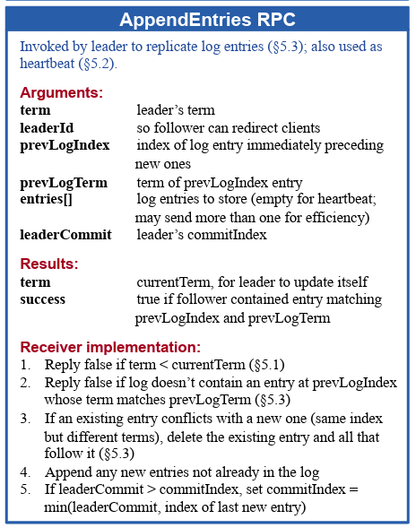

<!-- PROJECT LOGO -->   
 

# Raft
<!-- ABOUT THE PROJECT -->
This Project focuses on implementing a modified Raft system with the leader lease modification similar to those used by geo-distributed Database clusters such as [CockroachDB](https://www.cockroachlabs.com/) or [YugabyteDB](https://www.yugabyte.com/). 

Raft is a consensus algorithm designed for distributed systems to ensure fault tolerance and consistency. It operates through leader election, log replication, and commitment of entries across a cluster of nodes. The aim is to build a database that stores key-value pairs mapping string (key) to string (value).

### Built With
<!-- BUILT WITH -->
* [Python](https://www.python.org/)
* [gRPC](https://grpc.io/)
* [Google Cloud](https://cloud.google.com/)

### Table of Contents
<!-- TABLE OF CONTENTS -->

  
Table of Contents

  <ol>
    <li>
      <a href="#about-the-project">About The Project</a>
      <ul>
        <li><a href="#built-with">Built With</a></li>
      </ul>
    </li>
    <li><a href="#documentation">Documentation</a></li>
    <li>
      <a href="#getting-started">Getting Started</a>
      <ul>
        <li><a href="#prerequisites">Prerequisites</a></li>
        <li><a href="#installation">Installation</a></li>
      </ul>
    </li>
    <li><a href="#roadmap">Roadmap</a></li>
    <li><a href="#contributing">Contributing</a></li>
    <li><a href="#license">License</a></li>
    <li><a href="#contact">Contact</a></li>
    <li><a href="#acknowledgements">Acknowledgements</a></li>
  </ol>

## Documentation
<!-- DOCUMENTATION -->
### Storage and Database Options

The Raft Nodes serve the client for storing and retrieving these key-value pairs and replicating this data among other nodes in a fault-tolerant manner.

* The nodes are persistent, i.e., even after stopping the node, the data (logs) are stored locally (in human-readable format, .txt) along with other important metadata (commitLength, Term, and NodeID which the current node voted for in this term) and retrieved when the node starts again.

* #### Top level directory layout:
        .Raft/
        ├── Client
        |   ├── client.py
        |   ├── electio.proto
        ├── Node1               # Node initalized with id 1
        |   ├── dump
        |   ├── logs
        |   ├── node.py
        |   ├── metadata
        |   ├── electio.proto
        ├── Node2               # Node initalized with id 2
        |   ├── dump
        |   ├── logs
        |   ├── node.py
        |   ├── metadata
        |   ├── electio.proto

* #### logs
        NO-OP 0
        SET name1 Jaggu 0 [SET {key} {value} {term}]
        SET name2 Raju 0
        SET name3 Bheem 1

* #### dump
        Vote granted for Node 4 in term 1.
        Node 1 accepted AppendEntries RPC from 4.
        Node 1 accepted AppendEntries RPC from 4.
        Node 1 accepted AppendEntries RPC from 4.
        Node 1 (follower) committed the entry NO-OP 1 to the state machine.
        Node 1 accepted AppendEntries RPC from 4.
        Node 1 accepted AppendEntries RPC from 4.
        Node 1 accepted AppendEntries RPC from 4.

* #### Operations supported:

        SET K V: Maps the key K to value V; for example, {SET x hello}. (WRITE OPERATION)
        GET K: Returns the latest committed value of key K.

        * If K doesn’t exist in the database, an empty string will be returned as value by default. (READ OPERATION)

### Client Interaction

Followers, candidates, and a leader form a Raft cluster serving Raft clients. A Raft client implements the following functionality:

#### Leader Information:

* The client stores the IP addresses and ports of all the nodes. 
* The client stores the current leader ID, although this information might get outdated.

#### Request Server:
* It sends a GET/SET request to the leader node. (Refer to the Storage and Database Operations section)
    
    * In case of a failure, it updates its leader ID and resends the request to the updated leader.

        * The node returns what it thinks is the current leader and a failure message
        
        * If there is no leader in the system, then the node will return NULL for the current leader and a failure message

* The client continues sending the request until it receives a SUCCESS reply from any node.

Refer to the following RPC & Protobuf for the client and node details:

### RPC and Protobuf

Communication between nodes/servers requires two RPCs (AppendEntry and RequestVote). These RPCs have been explained in further detail in the [original Raft paper](https://www.google.com/url?q=https://raft.github.io/raft.pdf&sa=D&source=editors&ust=1718361831369760&usg=AOvVaw2RuIcsCKRsBApwxiYKKOrH):

These RPCs are modified as follows for leader lease:

* The AppendEntry RPC now also send the lease interval duration whenever the leader starts the lease timer.
* Through the RequestVoteReply RPC, the voters now also propagate the longest remaining duration time of an old leader’s lease (known to that voter) to the new candidate it is voting for.

For any other requirements refer [Documentation](https://github.com/Talkative-Banana/Raft/logo/Document.html)

## Getting Started
<!-- GETTING-STARTED -->
To get a local copy up and running follow these simple steps.

### Prerequisites
<!-- PREREQUISITES -->
* Basic understanding of Python (Tutorials: [English](https://youtu.be/_uQrJ0TkZlc) | [Hindi](https://youtu.be/gfDE2a7MKjA))
* Python installed on your computer ([Download from Here](https://www.python.org/downloads/))
* GitHub Account ([Sign Up](https://github.com/))
* gRPC ([Download from here](https://grpc.io/))

### Installation
<!-- INSTALLATION -->
* Clone the repo

        git clone https://github.com/Talkative-Banana/Raft.git
        chmmod +x runall.sh # (For linux users)
        run the sh file with asked parameters

For MacOS or Windows you need to either run each node and client manually or change the build file to run all of them locally.
## Deployment
<!-- DEPLOYMENT -->
### Remote Deployment

* Set up google cloud or docker containers and update the firewall settings to accept and send remote request.

* **node.py** and **client.py** have a static dictionary storing IP-address and IP port of all of different nodes which needs to be manually updated for gRPC communication. In case of local deployment all of the ip address are set to localhost.

* Grant permission to sh file and run it with required parameters.

### Local Deployment

* Simply grant permission to sh file and run it with required parameters.
## Roadmap
<!-- ROADMAP -->
- Clone the repo and open it in suitable IDE for complete project source code. You can also fix the issues and hence contribute.

## Contributing
<!-- CONTRIBUTING -->
Contributions are what make the open source community such an amazing place to be learn, inspire, and create. Any contributions you make are greatly appreciated.

1. Fork the Project
2. Create your Feature Branch
3. Commit your Changes
4. Push to the Branch
5. Open a Pull Request
## Contact
<!-- CONTACT -->
Email ID - lakshay21059@iiitd.ac.in
## Acknowledgements
<!-- ACKNOWLEDGEMENTS -->
Lakshay Bansal lakshay21059@iiitd.ac.in

